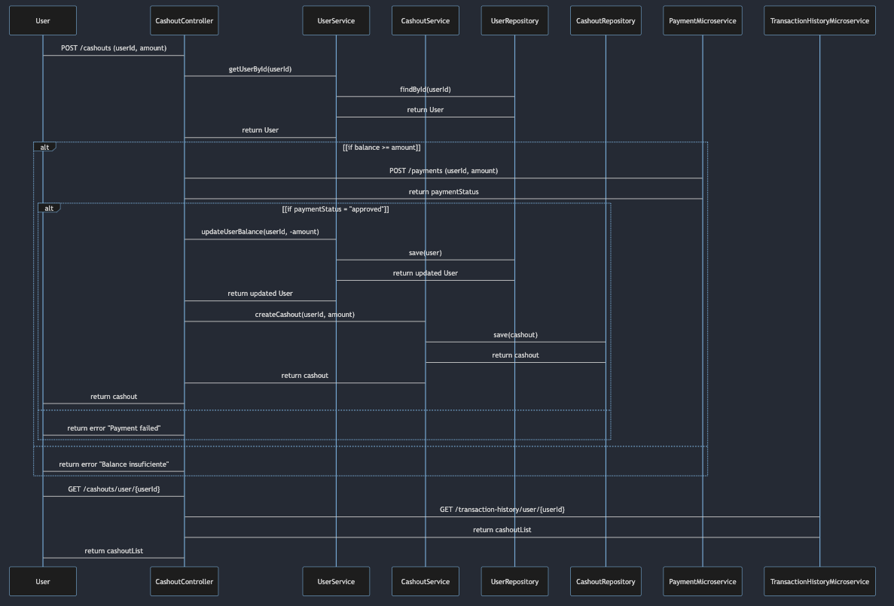

# Descripción del Taller con Microservicios
Este taller está diseñado para que los estudiantes construyan una aplicación utilizando Spring Boot WebFlux y microservicios. El objetivo es implementar un sistema que permita a los usuarios realizar un "cashOut" de productos. Parte del reto es implementar llamadas a otros microservicios desde dos de los endpoints principales. Para completar este taller, los estudiantes deben implementar los endpoints descritos a continuación y desarrollar un diagrama de secuencia que ilustre el flujo de las operaciones.

## Endpoints a Implementar

### User Endpoints
 1. **Obtener Usuario por ID**
    * Método: GET
    * URL: /users/{id}
    * Entrada: ID del usuario (Long)
    * Salida: Información del usuario (JSON)
    ```
    {
    "id": 1,
    "name": "John Doe",
    "balance": 100.0
    }
    ```

2. **Crear Usuario**
    * Método: POST
    * URL: /users
    * Entrada: Información del usuario (JSON)
    ```
    {
    "name": "John Doe",
    "balance": 100.0
    }
    ```
    * Salida: Información del usuario creado (JSON)
    ```
    {
    "id": 1,
    "name": "John Doe",
    "balance": 100.0
    }
    ```
3. **Actualizar Balance del Usuario**
    * Método: PUT
    * URL: /users/{id}/balance
    * Entrada: Monto a actualizar (JSON)
    ```
    {
    "amount": 50.0
    }
    ```
    * Salida: Información del usuario actualizado (JSON)
    ```
    {
    "id": 1,
    "name": "John Doe",
    "balance": 150.0
    }
    ```
### CashOut Endpoints
1. **Crear Cashout**
    * Método: POST
    * URL: /cashouts
    * Entrada: Solicitud de cashout (JSON)
    ```
    {
    "userId": 1,
    "amount": 50.0
    }
    ```
    * Salida: Información del cashout creado (JSON)
    ```
    {
    "id": 1,
    "userId": 1,
    "amount": 50.0
    }
    ```
    * Nota: Este endpoint debe llamar a un microservicio externo que maneje los pagos para verificar y procesar el cashout.

2. **Obtener CashOuts por ID de Usuario**
    * Método: GET
    * URL: /cashouts/user/{userId}
    * Entrada: ID del usuario (Long)
    * Salida: Lista de cashouts (JSON)
    ```
    [
      {
        "id": 1,
        "userId": 1,
        "amount": 50.0
      },
      {
        "id": 2,
        "userId": 1,
        "amount": 30.0
      }
    ]
    ```
    * Nota: Este endpoint debe llamar a un microservicio externo que maneje el historial de transacciones para obtener todos los cashouts relacionados con el usuario.

## Diagrama de Secuencia**

### Descripción del Diagrama
El diagrama de secuencia a continuación muestra el flujo de las operaciones para un cashout. El usuario inicia solicitando un cashout, el sistema verifica el balance del usuario, realiza la actualización del balance, llama a un microservicio externo de pagos y finalmente crea un registro de cashout.




## Instrucciones para el Taller

1. Crear la Aplicación Spring Boot: Inicia un nuevo proyecto Spring Boot con WebFlux.
2. Implementar Endpoints: Desarrolla los endpoints proporcionados en la sección anterior.
3. Implementar Servicios y Repositorios: Crea los servicios y repositorios necesarios para manejar la lógica de negocio y las operaciones con la base de datos.
4. Integrar Microservicios Externos: Implementa las llamadas a los microservicios externos para el manejo de pagos y el historial de transacciones.
5. Diagrama de Secuencia: Utiliza el diagrama de secuencia proporcionado para entender el flujo de las operaciones y asegúrate de que tu implementación siga este flujo.
6. Probar la Aplicación: Asegúrate de que todos los endpoints funcionen correctamente mediante pruebas unitarias e integradas.

## Entrega del Taller

1. Código Fuente: Subir el código fuente del proyecto a un repositorio en GitHub.
2. Documentación: Incluir una breve documentación explicando la implementación.
3. Diagrama de Secuencia: Adjuntar el diagrama de secuencia en el repositorio.

# Desarrollo del Taller
## Creación de la Aplicación Spring Boot
Para iniciar el taller, se creó una nueva aplicación Spring Boot con WebFlux. Para ello, se utílizo Spring Initializer como herramienta de creación del proyecto.
Se creó un nuevo proyecto con las siguientes características:
- Group: co.com.jorge
- Artifact: cashout
- Dependencies: Spring WebFlux, R2DBC, PostgreSQL, Validation

## Dominio de la Aplicación
* Se crearon las entidades de User y CashOut para manejar la información de los usuarios y los cashOuts.
* Se crearon las clases Payment y Balance para manejar la información de los pagos y el balance de los usuarios.
* Se creó enumeración para manejar el estado de los Payments.
* Se uso validación con Validator en las entidades para asegurar que los datos sean correctos.

## Lógica de Negocio
* Se crearon las interfaces de repositorio para las entidades de User y CashOut con el fin de manejar las operaciones de base de datos.
* Se crearon interfaces de servicio y clases de implementación para manejar la lógica de negocio de cada endpoint.

## Configuración de la Base de Datos
* Se configuró la base de datos PostgreSQL en el archivo application.yml.
* Se crearon las tablas correspondientes para las entidades de User y CashOut en la base de datos.
* Se implementó la conexión a la base de datos utilizando R2DBC.
* Se creó archivo docker compose para levantar la base de datos, el cual se aloja en carpeta deploy.

## Implementación de los Endpoints
* Se crearon controladores auxiliares PaymentsController y TransactionHistoryController para usarlos en las llamadas a los microservicios externos.
* Se implementaron los endpoints descritos en la sección anterior. Para ello, se crearon los controladores correspondientes y se definieron los métodos para cada uno de los endpoints.
* Se creó clase WebClientConfig para manejar la configuración de los clientes web para las llamadas a los microservicios externos.
* Se manejó la validación de las entradas y se implementaron las llamadas a los microservicios externos en los endpoints correspondientes.
* Se realizó manejo de excepciones personalizado para los casos en los que ocurran errores en las operaciones.
 
## Pruebas de la Aplicación
* Se implementaron pruebas unitarias e integradas para asegurar el correcto funcionamiento de los endpoints.
